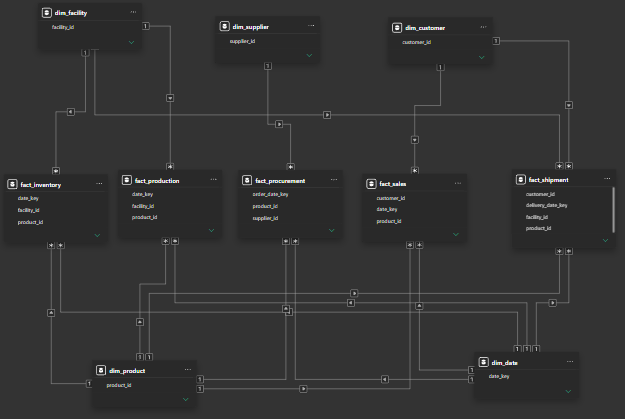
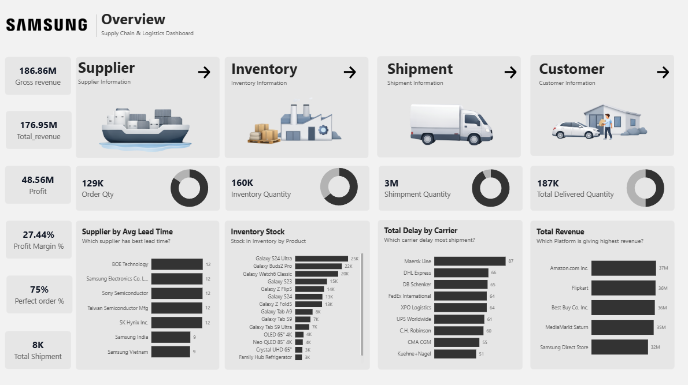
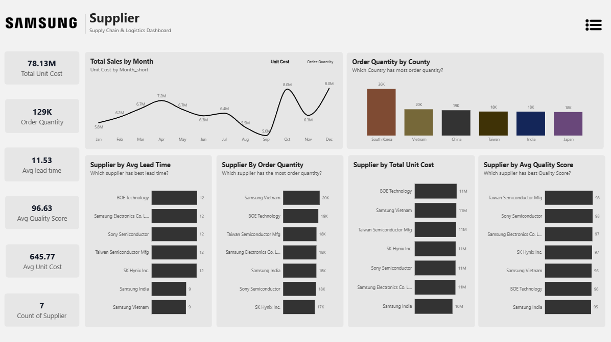
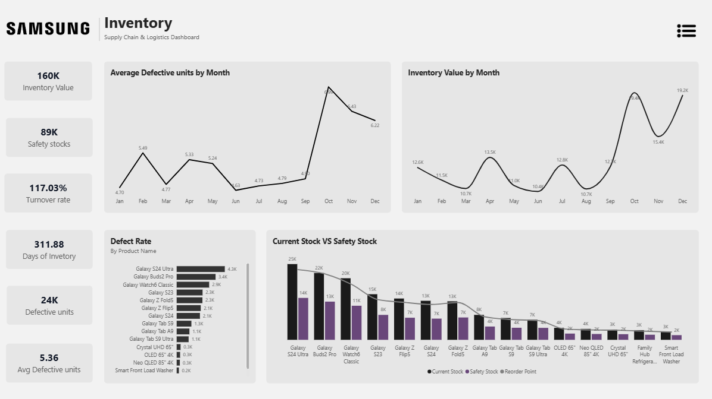
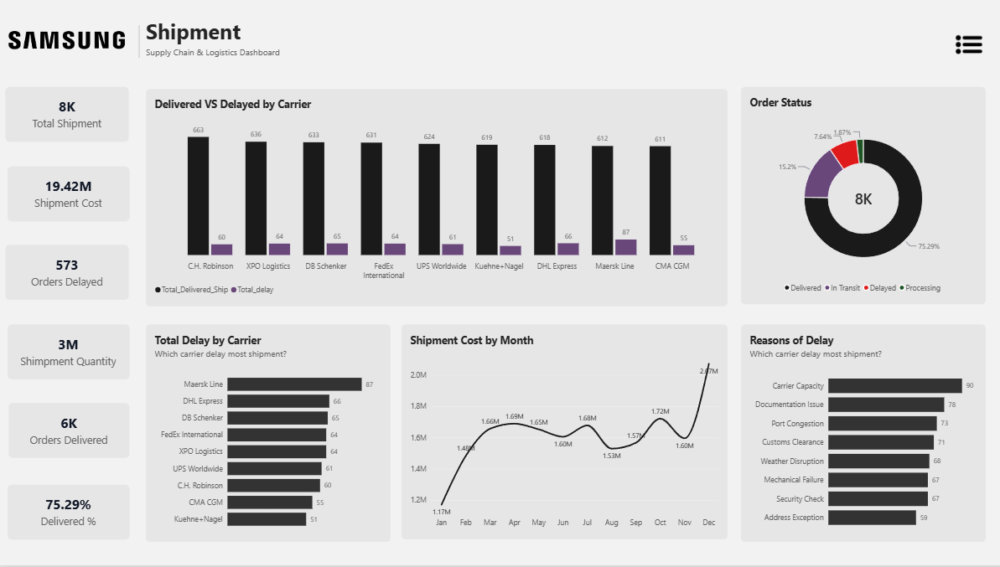
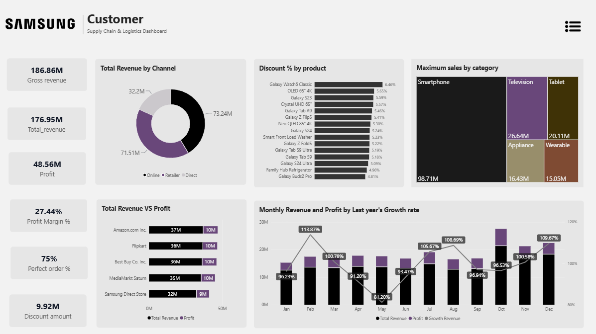

# Samsung Supply Chain & Logistics Analytics Dashboard

An end-to-end Power BI dashboard analyzing Samsung's simulated global supply chain — from supplier procurement through inventory, shipment logistics, and final sales across commercial channels. Built as a 6-page report: Home, Overview, Supplier, Inventory, Shipment, and Customer.


---

## 📌 Project Note

This project was built by following a guided tutorial to strengthen my Power BI and DAX skills. The dataset is **AI-generated (synthetic)**, not scraped or sourced from Samsung's real business data — it exists purely to simulate realistic supply chain relationships (suppliers, inventory, shipments, sales) for analytics practice.

What's genuinely mine in this project: the data modeling decisions, the DAX measures, the dashboard structure and page layout, and the analysis of what the data shows. I'm noting the tutorial/synthetic-data origin upfront so this is presented accurately.

---

## 🎯 Project Overview

The dashboard tracks the full operational pipeline for a simulated Samsung electronics supply chain:

**Raw material sourcing → Factory assembly → Warehouse inventory → Shipping logistics → Retail/e-commerce sales**

Goal: give supply chain stakeholders a single source of truth to spot bottlenecks (supplier delays, stock shortages, shipment failures) and connect them to downstream revenue and profit impact.

---

## 🗂️ Data Model

**Star schema** with 5 fact tables and 5 dimension tables:

| Fact Tables | Dimension Tables |
|---|---|
| fact_inventory | dim_facility |
| fact_production | dim_supplier |
| fact_procurement | dim_customer |
| fact_sales | dim_product |
| fact_shipment | dim_date |

- All fact tables connect to the relevant dimensions on shared keys (`facility_id`, `product_id`, `supplier_id`, `customer_id`, `date_key`) with **1-to-many relationships**, keeping filter propagation clean and DAX evaluation performant.
- `fact_shipment` and `fact_sales` both link to `dim_customer` and `dim_date`, connecting the logistics side of the model to the commercial side.
- `dim_date` acts as the central time dimension, joined across all five fact tables via their respective date keys (`date_key`, `order_date_key`, `delivery_date_key`).



---

## 📊 Dashboard Pages

### 1. Home
Branded landing page with the Samsung wordmark, dashboard title, and top navigation bar (Home, Overview, Supplier, Inventory, Shipment, Customer) alongside product imagery.


### 2. Overview
Landing/summary page showing top-line KPIs across all four functional areas with click-through navigation: **Gross Revenue ₹186.86M**, **Total Revenue ₹176.95M**, **Profit ₹48.56M**, **Profit Margin 27.44%**, **Perfect Order 75%**, **Total Shipments 8K**. Includes quick-view charts for Supplier Lead Time, Inventory Stock by Product, Total Delay by Carrier, and Total Revenue by platform.



### 3. Supplier
Tracks 7 suppliers across South Korea, Vietnam, China, Taiwan, India, and Japan. **Total Unit Cost ₹78.13M**, **Order Quantity 129K**, **Avg Lead Time 11.53 days**, **Avg Quality Score 96.63**. South Korea leads in order quantity (36K); BOE Technology and Samsung Vietnam top the cost/lead-time charts. A field parameter toggles the monthly trend chart between Unit Cost and Order Quantity.



### 4. Inventory
Warehouse and stock health: **Inventory Value 160K**, **Safety Stock 89K**, **Turnover Rate 117.03%**, **Days of Inventory 311.88**, **Defective Units 24K**. Defect rate spikes sharply in October (peak of the year) before tapering into November/December. Galaxy S24 Ultra carries both the highest current stock (25K) and the highest defect count (4.3K).



### 5. Shipment
Logistics performance: **Total Shipments 8K**, **Shipment Cost ₹19.42M**, **Orders Delayed 573**, **Orders Delivered 6K**, **Delivered % 75.29%**. Maersk Line has the highest delay count among carriers (87), followed by DHL Express (66). **Carrier Capacity** (90) and **Documentation Issues** (78) are the top two reasons for delay, ahead of Port Congestion, Customs Clearance, and Weather Disruption.



### 6. Customer
Commercial performance: **Gross Revenue ₹186.86M**, **Total Revenue ₹176.95M**, **Profit ₹48.56M**, **Profit Margin 27.44%**, **Discount Amount ₹9.92M**. Online is the largest revenue channel (₹73.24M), ahead of Retailer (₹71.51M) and Direct (₹32.2M). Amazon.com Inc. leads by platform revenue (₹37M), narrowly ahead of Flipkart and Best Buy Co. Inc. (₹36M each). Smartphones dominate category sales (₹98.71M). May was the weakest month for YoY growth (81.20%); October was the strongest (113.87%). A field parameter toggles the monthly chart between Total Revenue and Profit.



---

## 🧮 Key DAX Measures

Measures organized in a dedicated `Measures_table`. A few base measures (`Total_revenue`, `Total_shipment`, `Total_sales_quantity`) are reused across several derived ones — kept as separate measures rather than repeating the aggregation logic.

```dax
-- Core aggregations
Total_revenue = SUM(fact_sales[net_revenue])
Profit = SUM(fact_sales[profit])
Total_sales_quantity = SUM(fact_sales[quantity_sold])
Total_shipment = DISTINCTCOUNT(fact_shipment[shipment_id])
Inventory_Value = SUM(fact_inventory[stock_level])
Order_Qty = SUM(fact_procurement[order_quantity])

-- Profitability
Profit_margin % = DIVIDE([Profit], [Total_revenue])
Discount = SUM(fact_sales[discount_amount])
Discount % = 
    VAR product_amt = [Discount] + [Total_revenue]
    RETURN DIVIDE([Discount], product_amt)

Growth_revenue = 
    VAR curr_rev = [Total_revenue]
    VAR prev_rev = CALCULATE([Total_revenue], SAMEPERIODLASTYEAR(dim_date[date]))
    RETURN DIVIDE(curr_rev - prev_rev, prev_rev)

-- Supplier & procurement
Avg_lead_time = AVERAGE(fact_procurement[lead_time_days])
Total_sales_cost = SUM(fact_procurement[total_cost])

-- Inventory
Turnover rate = DIVIDE([Total_sales_quantity], [Inventory_Value])
Days of Inventory = DIVIDE(365, [Turnover rate])
Reorder Point = SUM(fact_inventory[reorder_point])
Safety_stocks = SUM(fact_inventory[safety_stock_level])

-- Production / quality
Defected_Rate = SUM(fact_production[defective_units])

-- Shipment & delivery
Total_Delivered_Ship = CALCULATE([Total_shipment], fact_shipment[status] = "Delivered")
Delivered % = DIVIDE([Total_Delivered_Ship], [Total_shipment])
Total_delay = CALCULATE([Total_shipment], fact_shipment[status] = "Delayed")
Shipment Cost = SUM(fact_shipment[shipping_cost])

Perfect order % = 
    VAR perfectOrder = CALCULATE([Total_shipment], 
        fact_shipment[status] = "Delivered", 
        fact_production[defect_rate_pct] < 1)
    RETURN DIVIDE(perfectOrder, [Total_shipment])
```

**Field Parameters** (for the toggleable line/bar charts on the Supplier and Customer pages):
```dax
Revenue_profit = {
    ("Total_revenue", NAMEOF('Measures_table'[Total_revenue]), 0),
    ("Profit", NAMEOF('Measures_table'[Profit]), 1)
}

Cost_quantity_supplier = {
    ("Unit Cost", NAMEOF('fact_procurement'[Total_unit_cost]), 0),
    ("Order Quantity", NAMEOF('Measures_table'[Order_Qty]), 1)
}
```
---

## 🎨 Technical & UI/UX Details

- Custom JSON theme applied for consistent brand colors across all pages
- Dynamic Field Parameters to swap chart measures without adding extra visuals
- Collapsible side filter panel to maximize report canvas space

---

## 🛠️ Tools Used

- **Power BI Desktop** — data modeling, DAX, report design
- **Power Query (M)** — data ingestion and transformation
- **DAX** — calculated measures and KPIs

---

## 📁 Repository Contents

```
├── Samsung_Supply_Chain_Dashboard.pbix
├── /Dataset                  # Source CSVs (synthetic/AI-generated)
├──/Images
├── /Screenshots
│   ├── Data_model.png
│   ├── Measures_table.png
│   ├── Home.png
│   ├── Overview.png
│   ├── Supplier.png
│   ├── Inventory.png
│   ├── Shipment.png
│   └── Customer.png
└── README.md
└── Supply_chain.pbix
```

---

## 🔍 What I'd Improve Next

- Replace synthetic data with a real open dataset to validate the model against messier, less clean data
- Add row-level security (RLS) for a multi-region stakeholder view
- Build out a incremental refresh setup to simulate a production data pipeline

---

## 📬 Contact

Feel free to connect or reach out with feedback.
